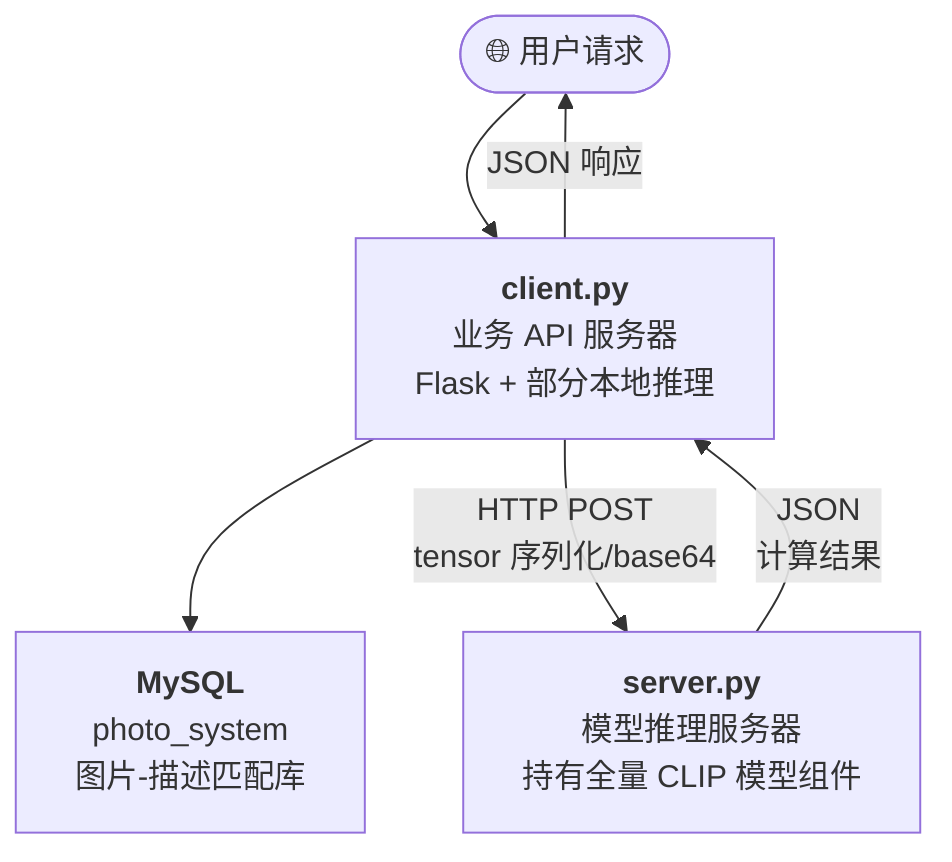
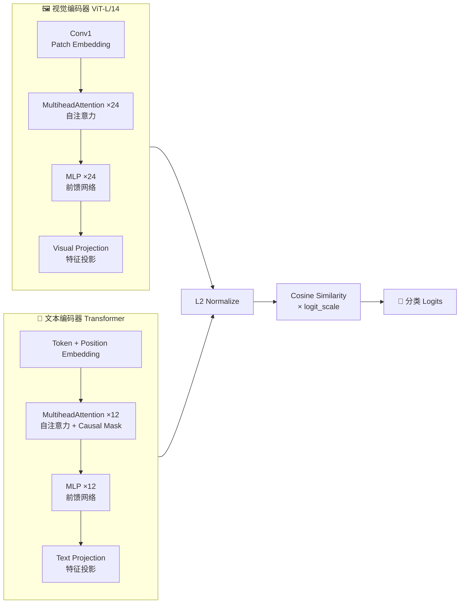
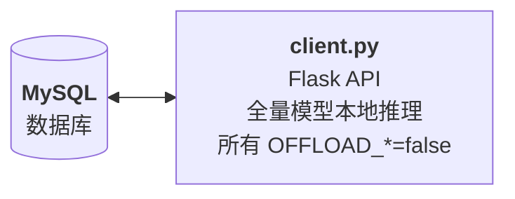
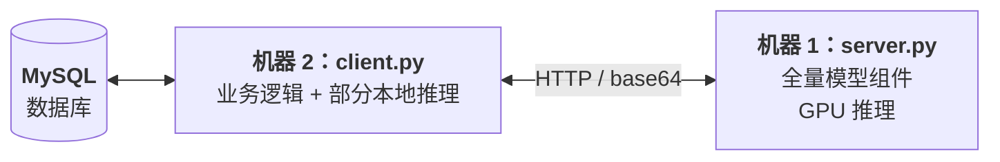
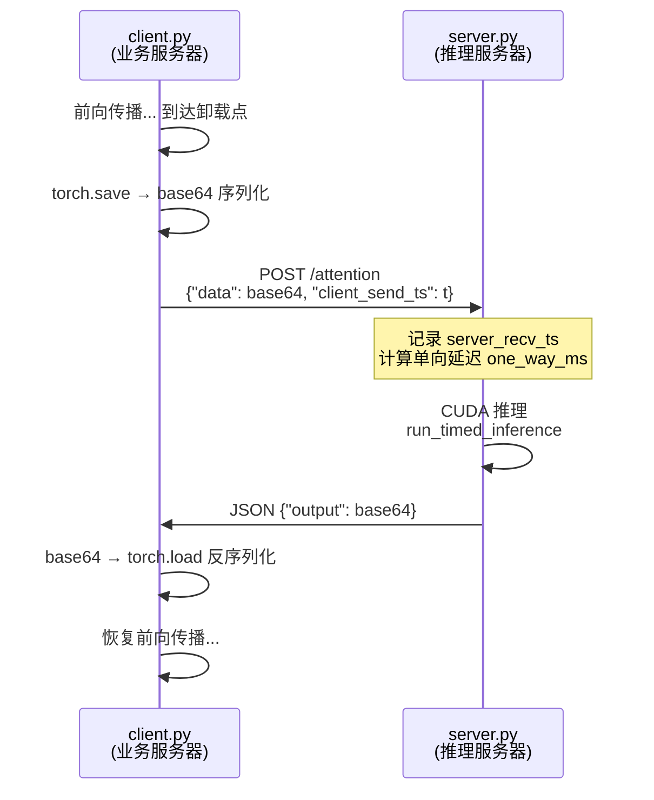

# CLIP 分布式部署与推理系统

[](https://www.python.org/)
[](https://pytorch.org/)
[](https://flask.palletsprojects.com/)
[](LICENSE)

基于 OpenAI CLIP (ViT-L-14) 模型的**分布式部署系统**，支持将模型组件灵活卸载到远程服务器执行，实现计算分离与性能可观测。

> 灵感来源于《软件体系结构》课程 — 探索模型拆分、远程调用与分布式推理的工程实践。

---

## 系统架构

### 总体架构（分布式模式）



### CLIP 模型组件拆分

CLIP ViT-L-14 被拆分为多个**可独立卸载的计算单元**：



### 三种卸载粒度

| 粒度 | 卸载单元 | 示例 endpoint | 当前状态 |
|---|---|---|---|
| **粗** | 完整编码器 | `/complete_encoders` | ✅ 已实现 |
| **中** | 编码器块级 / 投影层 / 卷积层 | `/encoder_blocks` `/vision_conv` | ✅ 已实现 |
| **细** | 单层 Attention / MLP（按层索引） | `/attention` `/mlp` | 🔧 模块级控制已实现，逐层粒度待扩展 |

---

## 运行模式

### 模式 A：单机部署

所有推理在本地完成，**仅需 1 台机器 + 1 个 MySQL**。



适用场景：开发调试、单机演示、低延迟需求。

### 模式 B：分布式部署

将部分/全部模型组件卸载到专用推理服务器。



适用场景：计算分离、GPU 资源集中管理、多客户端共享推理服务。

### 卸载数据流

一次远程 Attention 调用的完整流程：



---

## 项目结构

```
CLIP_local/
├── server.py                 # 模型推理服务器（持有全量模型组件）
├── client.py                 # 业务 API 服务器（可卸载到 server）
├── model/
│   ├── clip_loader.py        # CLIP 模型构建、权重加载、组件拆解
│   ├── encoder.py            # Transformer 基础模块（Attention / MLP / LayerNorm）
│   ├── image.py              # Vision Transformer + ModifiedResNet
│   ├── text.py               # Text Transformer
│   └── simple_tokenizer.py   # BPE 分词器
├── utils/
│   ├── config.py             # 环境变量配置 + OFFLOAD_CONFIG
│   ├── offloader.py          # 远程调用处理器（OffloadHandler）
│   ├── pred.py               # 预测管线（图片加载 + 前向推理）
│   ├── speed_measurement.py  # 统一推理测速 + CUDA 同步
│   └── setup.py              # 日志 & 设备初始化
├── manager/
│   └── db_manager.py         # MySQL 连接池
├── ViT-L-14.pt               # 模型权重（~890MB，需 git LFS）
├── requirements.txt          # Python 依赖
├── .env.example              # 环境变量模板
└── README.md
```

---

## 快速开始

### 1. 环境要求

- Python 3.10+
- CUDA 11.8+（GPU 推理推荐）
- MySQL 8.0+（数据库）

```bash
pip install -r requirements.txt
```

### 2. 模型权重

`ViT-L-14.pt` 约 890MB，需要 Git LFS 拉取：

```bash
git lfs install
git lfs pull
```

> 也可从 [OpenAI CLIP](https://github.com/openai/CLIP) 手动下载 ViT-L-14 权重文件放入项目根目录。

### 3. 数据库

```sql
CREATE DATABASE photo_system CHARACTER SET utf8mb4;
```

系统需要 `photos` 和 `photo_description` 两张表（由数据库初始化脚本维护）。

### 4. 环境变量配置

复制模板并编辑：

```bash
cp .env.example .env
```

| 变量 | 说明 | 示例 |
|---|---|---|
| `SERVER_IP` | 推理服务器 IP | `192.168.1.100` |
| `SERVER_PORT` | 推理服务器端口 | `5000` |
| `DB_HOST` | MySQL 地址 | `127.0.0.1` |
| `DB_PORT` | MySQL 端口 | `3306` |
| `DB_USER` | 数据库用户 | `root` |
| `DB_PASSWORD` | 数据库密码 | `your_password` |
| `DB_NAME` | 数据库名 | `photo_system` |

**卸载开关（按需开启）：**

| 变量 | 控制组件 | 对应 endpoint |
|---|---|---|
| `OFFLOAD_VISUAL_ATTN` | 视觉 Attention×24 | `/attention` |
| `OFFLOAD_VISUAL_MLP` | 视觉 MLP×24 | `/mlp` |
| `OFFLOAD_TEXT_ATTN` | 文本 Attention×12 | `/attention` |
| `OFFLOAD_TEXT_MLP` | 文本 MLP×12 | `/mlp` |
| `OFFLOAD_VISUAL_CONV` | 视觉卷积层 | `/vision_conv` |
| `OFFLOAD_VISUAL_PROJ` | 视觉投影层 | `/visual_projection` |
| `OFFLOAD_TEXT_PROJ` | 文本投影层 | `/text_projection` |
| `OFFLOAD_COMPLETE_ENCODER` | 完整图文编码 | `/complete_encoders` |
| `OFFLOAD_COS_SIM` | 余弦相似度 | `/cos_sim` |
| `OFFLOAD_VISUAL_ENCODER` | 视觉编码器块 | `/encoder_blocks` |
| `OFFLOAD_TEXT_ENCODER` | 文本编码器块 | `/encoder_blocks` |

### 5. 启动

**模式 A — 单机：**

```bash
# .env 中所有 OFFLOAD_*=false
python client.py
# → 监听 0.0.0.0:5000，提供业务 API + 本地推理
```

**模式 B — 分布式：**

```bash
# 机器 1：推理服务器
python server.py
# → 监听 0.0.0.0:5000，等待 client 的卸载请求

# 机器 2：业务 API 服务器
# 在 .env 中设置 SERVER_IP=<机器1的IP>，并按需开启 OFFLOAD_*
python client.py
# → 监听 0.0.0.0:5000，推理卸载到机器 1
```

---

## API 参考

### Client API（业务接口）

| 方法 | 端点 | 说明 |
|---|---|---|
| `GET` | `/health` | 健康检查 |
| `POST` | `/predict` | 图片分类 |
| `POST` | `/upload` | 批量图片-描述匹配入库 |
| `POST` | `/getPhotos` | 以文搜图（返回 Top-5 图片） |

**`POST /predict` 请求体：**

```json
{
    "image_urls": ["https://example.com/cat.jpg", "/local/dog.png"],
    "class_names": ["cat", "dog", "bird"]
}
```

### Server API（模型推理接口）

| 方法 | 端点 | 卸载粒度 | 说明 |
|---|---|---|---|
| `POST` | `/attention` | 细 | 单层 Attention 推理 |
| `POST` | `/mlp` | 细 | 单层 MLP 推理 |
| `POST` | `/vision_conv` | 中 | 视觉卷积层（Patch Embedding） |
| `POST` | `/visual_projection` | 中 | 视觉投影层 |
| `POST` | `/text_projection` | 中 | 文本投影层 |
| `POST` | `/encoder_blocks` | 中 | 完整编码器块（24/12层） |
| `POST` | `/complete_encoders` | 粗 | 完整图文编码 + 余弦相似度 |
| `POST` | `/cos_sim` | 中 | 余弦相似度计算 |
| `GET` | `/health` | - | 健康检查 |

### 传输协议

所有模型推理接口使用统一的序列化协议：

```
请求: JSON { data: base64(torch.save(tensor_dict)), client_send_ts: float }
响应: JSON { output: base64(torch.save({'output': tensor})) }
```

---

## 卸载机制

### 核心类：`OffloadHandler`

```
utils/offloader.py
├── should_offload(module_type)  →  查询 OFFLOAD_CONFIG 决定是否卸载
└── call_remote(endpoint, data_dict, device, fallback_fn)
    ├── 序列化：torch.save → io.BytesIO → base64
    ├── HTTP POST 到 server
    ├── 反序列化：base64 → io.BytesIO → torch.load
    └── 失败降级：自动调用 fallback_fn 本地计算
```

### 降级策略

当远程调用失败（网络超时、server 不可达）时，自动回退到本地计算：

```python
# model/encoder.py — encoder.py 中的典型调用模式
if self.offload_handler and self.offload_handler.should_offload(f"{self.encoder_type}_attn"):
    return self.offload_handler.call_remote(
        endpoint='attention',
        data_dict={'x': x, ...},
        device=x.device,
        fallback_fn=lambda: self._attention_local(x)  # ← 失败时本地执行
    )
else:
    return self._attention_local(x)
```

---

## 性能可观测性

### 测速体系

系统提供**分层计时**，便于定位性能瓶颈：

| 测量位置 | 测量内容 | 计时工具 |
|---|---|---|
| `run_timed_inference` | 推理耗时（GPU/CPU） | `time.perf_counter` + CUDA sync |
| Server 端点 | 单向网络延迟 `one_way_ms` | `client_send_ts` vs `server_recv_ts` |
| `OffloadHandler.call_remote` | HTTP 往返时间 `rtt` | `time.perf_counter` |

### 日志示例

```
# 服务端推理日志
[attention] local_ip=10.0.0.2 server_ip=10.0.0.1 infer_ms=2.341 one_way_ms=15.200 type=cuda

# 客户端传输日志
[attention] server=10.0.0.1 rtt=18.52ms type=传输

# 客户端本地推理日志
[mlp] infer_ms=1.823 type=cuda
```

---

## 后续可优化方向

- [ ] **逐层粒度卸载** — `should_offload()` 扩展 `layer_id` 参数，支持 `OFFLOAD_VISUAL_ATTN_5=true` 级别精确控制（详见 `utils/offloader.py` 中的 TODO 注释）
- [ ] **GPU 并行编码** — server 端 `/complete_encoders` 已支持 `nn.parallel.parallel_apply`，可扩展到双 GPU
- [ ] **gRPC 替代 HTTP** — 减少序列化开销，支持 streaming（用gRPC代替base64编码，速度会更快，同时安全性更强）
- [ ] **模型量化** — INT8/FP16 推理降低 GPU 内存占用，可以权衡性能与精度（目前仅支持 FP16，后续可引入量化库如 `torch.quantization`）

---

## 技术栈

| 层级 | 技术 |
|---|---|
| 模型 | PyTorch 2.5, CLIP ViT-L-14, Vision Transformer |
| 推理框架 | Flask 3.1 |
| 数据库 | MySQL 8.0, mysql-connector |
| 序列化 | torch.save/load + base64 |
| 图像处理 | Pillow, OpenCV, torchvision |
| 分词 | BPE (byte-pair encoding) |

---

## License

MIT License
